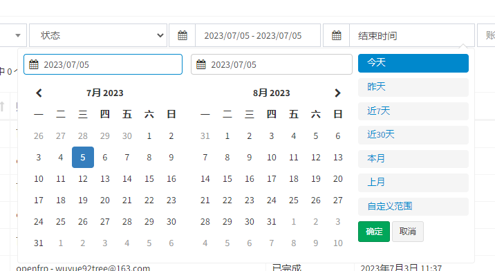

# Guide

## Simple Example
inherit `adminlte.core.AdminlteConfig`，and add `ADMINLTE_CONFIG_CLASS` in django settings
### Inherit AdminlteConfig
```python title='adminlte_config.py'
# myserver/utils/adminlte_config.py
from adminlteui.core import AdminlteConfig

class MyAdminlteConfig(AdminlteConfig):
    skin = 'red'
    welcome_sign = 'welcome to xxx backend system'
    ...
```
### Settings in django
```python title='settings.py'
ADMINLTE_CONFIG_CLASS = 'myserver.utils.adminlte_config.MyAdminlteConfig'
```

## Params
### Basic Info
#### show_avatar
show avatar or not，default is `False`
#### avatar_field
avatar field or url，default is `None`，will render as `adminlteui/static/admin/dist/img/default.jpg`
#### username_field
username fields，default is `None`，will render as `request.user.username`
#### site_logo
site logo，default is `None`，will render as `adminlteui/static/admin/dist/img/default-log.svg`
#### skin
site skin，default is `None`，will render as `blue`
#### sidebar_layout
sidebar layout，default is `fixed`，choices：['boxed', 'fixed']
#### search_form
show search form or not，default is `True`
#### copyright
copyright，default is `None`，will render as django-adminlte-ui version
#### welcome_sign
welcome sign（login page），default is `None`，will render as 'Login and Enjoy'
### Menu
Menu inherit `adminlte.core.MenuItem`，you can modify the left menu and top menu

MenuItem has three type of `menu_type`

- group：Group，you can make two or more MenuItem(`model` or `link`) in side the same menu level
- model：bind model which registered in admin by label，label like `app_label.modelName`
- link：normal link type，setup url direct

example
```python title='adminlte_config.py'
from adminlte.core import MenuItem

class MyAdminlteConfig(AdminlteConfig):
    main_menu = [
        MenuItem(label='rpa', name='RPA服务', child=[
            MenuItem(label='rpa.Collector', menu_type='model'),
            MenuItem(label='third', name='三级菜单', child=[
                MenuItem(label='github', name='Github', url='https://github.com/wuyue92tree', target_blank=True, menu_type='link'),
            ]),
        ]),
        MenuItem(label='auth', name='认证和授权', icon='fa-users', child=[
            MenuItem(label='auth.User', name='用户', menu_type='model'), # (1)
            MenuItem(label='auth.Group', name='组', menu_type='model'),
            MenuItem(label='auth.link', name='/admin/auth/', menu_type='link', permissions=['auth.view_user']), # (2)
        ]),
    ]
    top_menu = [
        MenuItem(label='outside_link', name='外部资源', child=[
            MenuItem(label='github', name='Github', url='https://github.com/wuyue92tree', target_blank=True, menu_type='link'),
        ]),
        MenuItem(label='rpa.Collector', menu_type='model'),
    ]
```

effect


1. when menu_type is model，if name not setup, will show the model verbose_name
2. when menu_type is link, you can control menu show or not show by bind model permission, `permissions` default None, will not check permission

#### main_menu
main menu（left menu），default is `[]`，will render as all registered model in admin
> Tips: Support multilevel menu
#### top_menu
top menu，default is `[]`，will show nothing
> Tips: Top menu will not show icon，only support secondary menu max

## ModelAdmin
### external ModelAdmin in django

- make table filter support `select2` in `change_list` page
- custom search field placeholder for `change_list` page

example
```python title='admin.py'
from adminlte.admin import ModelAdmin

class CollectorModelAdmin(ModelAdmin):
  select2_list_filter = ('project', 'source') # (1)
  search_field_placeholder = '描述/起始URL' # (2)
  ...
```

1. add field in to this tuple which need select2 filter
2. setup placeholder for search field

effect


### Custom Filters
#### DateRangeFilter

example:
```python title='rap/admin.py'
from adminlteui.admin import ModelAdmin
from adminlteui.filters import DateRangeFilter

class AutomationTaskRecordAdmin(CommonAdmin, ModelAdmin):
    list_display = ('id', 'automation', 'account', 'status', 'start_time',
                    'end_time', 'update_time')
    list_filter = ('automation__project', 'automation__source',
                   'status', ('start_time', DateRangeFilter), ('end_time', DateRangeFilter))

```
effect:


## Widgets

### AdminlteSelect

> Since v1.5.0b0, you don't need to modify new template to active select2.

example:
```python title='rpa/admin.py'
@admin.register(Collector)
class CollectorAdmin(admin.ModelAdmin):
    ...
    formfield_overrides = {
        models.ForeignKey: {'widget': AdminlteSelect}
    }
```
effect:


### AdminlteSelectMultiple

> Since v1.5.0b0, you don't need to modify new template to active select2.

example:
```python title='rpa/admin.py'
@admin.register(Collector)
class CollectorAdmin(admin.ModelAdmin):
    ...
    formfield_overrides = {
        # multiple for ManayToManyField
        models.ManayToManyField: {'widget': AdminlteSelectMultiple(
            attr={'style': 'width: 100%'}
        )}
    }
```
effect:


