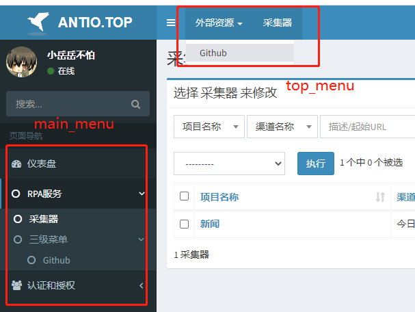

# 指南

## 简单的示例
通过继承`adminlte.core.AdminlteConfig`，并在django的settings中添加配置实现
### 继承AdminlteConfig
```python title='adminlte_config.py'
# myserver/utils/adminlte_config.py
from adminlteui.core import AdminlteConfig

class MyAdminlteConfig(AdminlteConfig):
    skin = 'red'
    welcome_sign = '欢迎访问xxx后端系统'
    ...
```
### django中settings配置
```python title='settings.py'
ADMINLTE_CONFIG_CLASS = 'myserver.utils.adminlte_config.MyAdminlteConfig'
```

## 参数详解
### 基础信息
#### show_avatar
是否显示头像，默认为`False`
#### avatar_field
头像对应的url或者用户头像字段，默认为`None`，将渲染为`adminlteui/static/admin/dist/img/default.jpg`
#### username_field
用户名显示，默认为`None`，将渲染为`request.user.username`
#### site_logo
站点logo，默认为`None`，将渲染为`adminlteui/static/admin/dist/img/default-log.svg`
#### skin
站点主题，默认为`None`，将渲染为`blue`
#### sidebar_layout
侧边栏布局，默认为`fixed`，可选：['boxed', 'fixed']
#### search_form
是否显示搜索框，默认为`True`
#### copyright
版权，默认为`None`，将渲染为django-adminlte-ui版本号
#### welcome_sign
欢迎标志（登录页），默认为`None`，将渲染为芝麻开门
### 菜单
菜单通过继承`adminlte.core.MenuItem`实现，可对左侧菜单及顶部菜单进行自定义

MenuItem有三种`menu_type`

- group：分组，用于将多个`model`或`link`类型的MenuItem显示到同一级菜单中
- model：通过`label`绑定通过admin中注册的model页面，label命名规则`app_label.modelName`
- link：普通链接类型，直接通过url指定链接

示例
```python title='adminlte_config.py'
from adminlte.core import MenuItem

class MyAdminlteConfig(AdminlteConfig):
    main_menu = [
        MenuItem(label='rpa', name='RPA服务', child=[
            MenuItem(label='rpa.Collector', menu_type='model'),
            MenuItem(label='third', name='三级菜单', child=[
                MenuItem(label='github', name='Github', url='https://github.com/wuyue92tree', target_blank=True, menu_type='link'),
            ]),
        ]),
        MenuItem(label='auth', name='认证和授权', icon='fa-users', child=[
            MenuItem(label='auth.User', name='用户', menu_type='model'), # (1)
            MenuItem(label='auth.Group', name='组', menu_type='model'),
        ]),
    ]
    top_menu = [
        MenuItem(label='outside_link', name='外部资源', child=[
            MenuItem(label='github', name='Github', url='https://github.com/wuyue92tree', target_blank=True, menu_type='link'),
        ]),
        MenuItem(label='rpa.Collector', menu_type='model'),
    ]
```

效果图



1. menu_type类型为model时，若不指定name，则默认显示为原model的verbose_name

#### main_menu
主菜单（左侧菜单），默认为`[]`，将渲染为所有已注册到admin中的model
> Tips: 可实现多级菜单
#### top_menu
顶部菜单，默认为`[]`，将渲染为空
> Tips: 顶部菜单将不显示Icon，并且最多显示二级菜单，多余的将被隐藏

## ModelAdmin
扩展django的ModelAdmin

- 让`change_list`页面的table过滤器支持`select2`
- 自定义`change_list`页面搜索框的placeholder提示

示例
```python title='admin.py'
from adminlte.admin import ModelAdmin

class CollectorModelAdmin(ModelAdmin):
  select2_list_filter = ('project', 'source') # (1)
  search_field_placeholder = '描述/起始URL' # (2)
  ...
```

1. 将需要使用select2的筛选fields加入该tuple中
2. 将待显示的搜索框提示信息赋值

效果图


## Widgets组件

### AdminlteSelect

> 自 v1.5.0b0 版本之后, 将不再需要通过template覆盖的方式激活select2.

示例:
```python title='rpa/admin.py'
@admin.register(Collector)
class CollectorAdmin(admin.ModelAdmin):
    ...
    formfield_overrides = {
        models.ForeignKey: {'widget': AdminlteSelect}
    }
```
效果图:


### AdminlteSelectMultiple

> 自 v1.5.0b0 版本之后, 将不再需要通过template覆盖的方式激活select2.

示例:
```python title='rpa/admin.py'
@admin.register(Collector)
class CollectorAdmin(admin.ModelAdmin):
    ...
    formfield_overrides = {
        # multiple for ManayToManyField
        models.ManayToManyField: {'widget': AdminlteSelectMultiple(
            attr={'style': 'width: 100%'}
        )}
    }
```
效果图:


